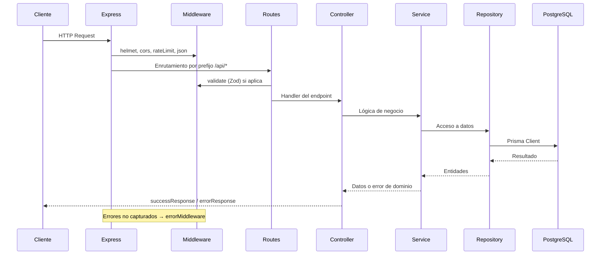

# Arquitectura

## Estructura de carpetas

```text
backend/
├── src/
│   ├── app.ts                 # Configuración Express y montaje de rutas
│   ├── server.ts              # Punto de entrada HTTP
│   ├── config/
│   │   ├── env.ts             # Variables de entorno
│   │   ├── prisma.ts          # Cliente Prisma con adapter pg
│   │   └── swagger.ts         # Especificación OpenAPI
│   ├── features/              # Módulos por dominio
│   │   ├── health/
│   │   ├── requests/
│   │   ├── service-types/
│   │   └── technicians/
│   ├── middlewares/
│   │   ├── error.middleware.ts
│   │   └── validate.middleware.ts
│   └── utils/
│       └── api-response.ts
├── prisma/
│   ├── schema.prisma
│   ├── seed.ts
│   └── migrations/
├── tests/
│   ├── integration/
│   ├── unit/
│   └── setup/
├── docker-compose.yml
└── prisma.config.ts
```

Cada feature sigue el patrón **Routes → Controller → Service → Repository → Prisma**, salvo `health`, que no define capa de rutas separada más allá de su propio módulo.

## Flujo de una petición HTTP



## Middleware global (app.ts)

Aplicados en este orden antes de las rutas:

1. **Helmet** — cabeceras de seguridad HTTP.
2. **CORS** — origen configurable vía `CORS_ORIGIN` (predeterminado `http://localhost:4200`).
3. **Rate limiting** — 100 peticiones por IP cada 15 minutos.
4. **express.json** — cuerpo JSON con límite de 1 MB.

Tras las rutas se monta `errorMiddleware` como manejador central de errores.

## Responsabilidades por capa

| Capa           | Responsabilidad                                                    | Ubicación                |
| -------------- | ------------------------------------------------------------------ | ------------------------ |
| **Routes**     | Define endpoints HTTP y encadena middlewares de validación         | `*.routes.ts`            |
| **Controller** | Traduce HTTP ↔ servicio; formatea respuestas con `successResponse` | `*.controller.ts`        |
| **Service**    | Reglas de negocio (existencia de técnico/tipo, dashboard)          | `*.service.ts`           |
| **Repository** | Consultas Prisma; filtros, paginación e includes                   | `*.repository.ts`        |
| **validate**   | Parseo y validación Zod de body, params o query                    | `validate.middleware.ts` |
| **error**      | Mapeo de `ZodError`, errores de dominio y códigos Prisma           | `error.middleware.ts`    |

## Montaje de rutas

| Prefijo              | Módulo        |
| -------------------- | ------------- |
| `/api/health`        | Health        |
| `/api/requests`      | Requests      |
| `/api/technicians`   | Technicians   |
| `/api/service-types` | Service Types |
| `/api-docs`          | Swagger UI    |

En solicitudes, la ruta `/dashboard` se registra **antes** de `/:id` para evitar colisión con el parámetro `id`.

## Formato de respuesta

Todas las respuestas JSON siguen el contrato definido en `src/utils/api-response.ts`:

**Éxito:**

```json
{
  "success": true,
  "data": {},
  "message": "Mensaje descriptivo",
  "meta": {}
}
```

`meta` solo se incluye cuando el controlador lo proporciona (p. ej. paginación en listados).

**Error:**

```json
{
  "success": false,
  "message": "Descripción del error",
  "code": "CODIGO_ERROR",
  "errors": []
}
```

`errors` aparece en errores de validación (`VALIDATION_ERROR`) con detalle por campo.

## Inyección de dependencias

Las clases exportan instancias singleton (`requestService`, `requestController`, etc.) con dependencias por defecto. Para tests, `createRequestRoutes` y constructores aceptan instancias alternativas (ver `tests/setup/`).

## Cliente de base de datos

`src/config/prisma.ts` instancia `PrismaClient` con el adapter `@prisma/adapter-pg` y la cadena de conexión de `DATABASE_URL`. Los tests de integración de solicitudes usan un cliente separado apuntando a `DATABASE_URL_TEST`.
