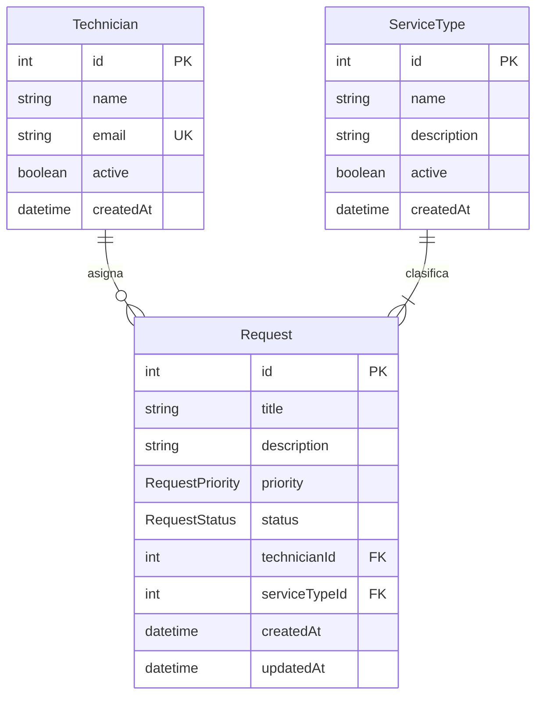

# Modelo de datos

Definido en `prisma/schema.prisma`. PostgreSQL es el proveedor; las tablas usan nombres en snake_case vía `@@map`.

## Enums

### RequestStatus

| Valor | Uso |
|---|---|
| `PENDING` | Solicitud creada, sin asignación explícita de estado |
| `ASSIGNED` | Asignada a un técnico |
| `IN_PROGRESS` | En curso |
| `RESOLVED` | Resuelta |
| `CANCELLED` | Cancelada |

Predeterminado en modelo: `PENDING`.

### RequestPriority

| Valor |
|---|
| `LOW` |
| `MEDIUM` |
| `HIGH` |
| `CRITICAL` |

Predeterminado en modelo: `MEDIUM`.

## Entidades

### Technician (`technicians`)

| Campo | Tipo | Restricciones |
|---|---|---|
| `id` | `Int` | PK, autoincrement |
| `name` | `String` | Requerido |
| `email` | `String` | Requerido, único |
| `active` | `Boolean` | Predeterminado `true` |
| `createdAt` | `DateTime` | Predeterminado `now()` |

Relación: uno a muchos con `Request`.

### ServiceType (`service_types`)

| Campo | Tipo | Restricciones |
|---|---|---|
| `id` | `Int` | PK, autoincrement |
| `name` | `String` | Requerido |
| `description` | `String?` | Opcional |
| `active` | `Boolean` | Predeterminado `true` |
| `createdAt` | `DateTime` | Predeterminado `now()` |

Relación: uno a muchos con `Request`.

### Request (`requests`)

| Campo | Tipo | Restricciones |
|---|---|---|
| `id` | `Int` | PK, autoincrement |
| `title` | `String` | Requerido |
| `description` | `String` | Requerido |
| `priority` | `RequestPriority` | Predeterminado `MEDIUM` |
| `status` | `RequestStatus` | Predeterminado `PENDING` |
| `technicianId` | `Int?` | FK opcional → `technicians.id` |
| `serviceTypeId` | `Int` | FK requerida → `service_types.id` |
| `createdAt` | `DateTime` | Predeterminado `now()` |
| `updatedAt` | `DateTime` | Actualizado automáticamente (`@updatedAt`) |

Índices: `technicianId`, `serviceTypeId`, `status`, `priority`.

## Relaciones y reglas referenciales

Definidas en la migración inicial `20260907221426_init`:

| Relación | ON DELETE | ON UPDATE |
|---|---|---|
| `requests.technicianId` → `technicians.id` | `SET NULL` | `CASCADE` |
| `requests.serviceTypeId` → `service_types.id` | `RESTRICT` | `CASCADE` |

Implicaciones:

- Eliminar un técnico no borra solicitudes; deja `technicianId` en `NULL`.
- No se puede eliminar un tipo de servicio si tiene solicitudes asociadas.

## Diagrama entidad-relación

## Datos de seed

`prisma/seed.ts` borra todas las solicitudes, tipos de servicio y técnicos antes de insertar:

- 4 técnicos activos.
- 5 tipos de servicio activos.
- 8 solicitudes con distintos estados y prioridades.

El seed requiere `DATABASE_URL` configurada y usa el mismo adapter `@prisma/adapter-pg` que la aplicación.
